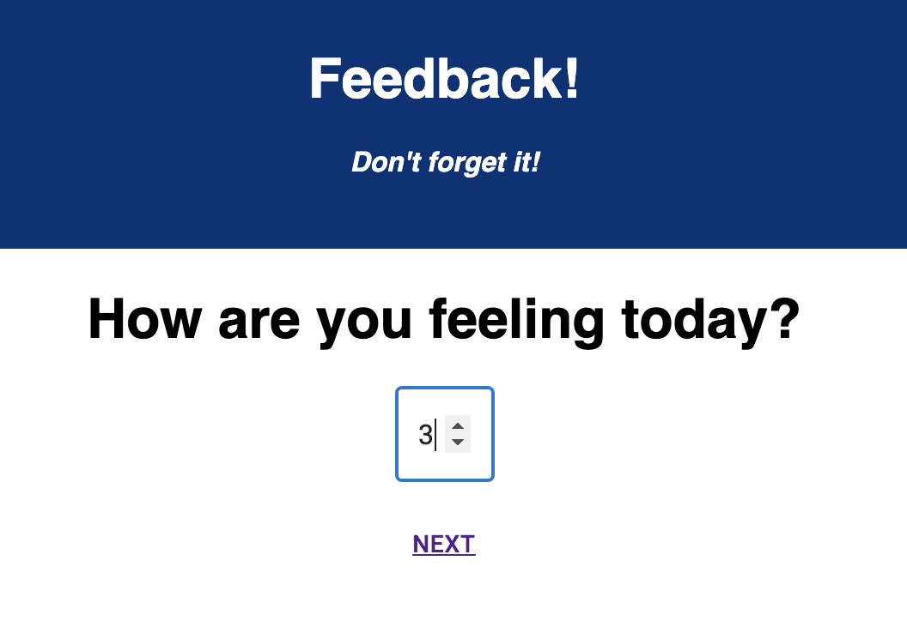

# FEEDBACK LOOP

## Description

Feedback Loop is a minimalist app that allows the user to easily submit ratings for their feelings, understanding, support received, and any comments. 

## Screenshots 

## Usage

Click through the form and choose numbers to represent your experience. For each, 5 is the most satisfactory response, and 1 is the least. If needed, use the back/next buttons to change your previous answers. Before submitting, you will have a chance to review your feedback and go back to make any changes. 

## Built With

## Acknowledgements

Thank you to all my fellow Prime-rs in the #ionian cohort for cheering each other on as we near the finish line! Thanks to my wonderful partner Mike for providing support and snacks. 
